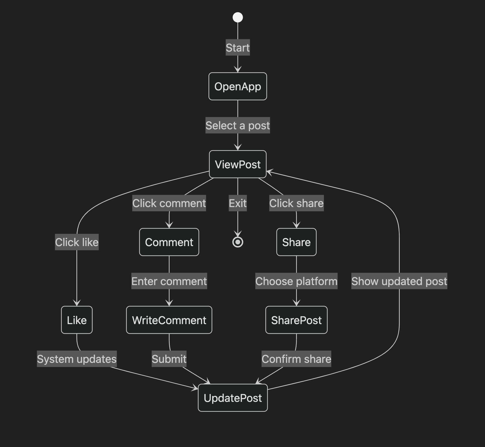
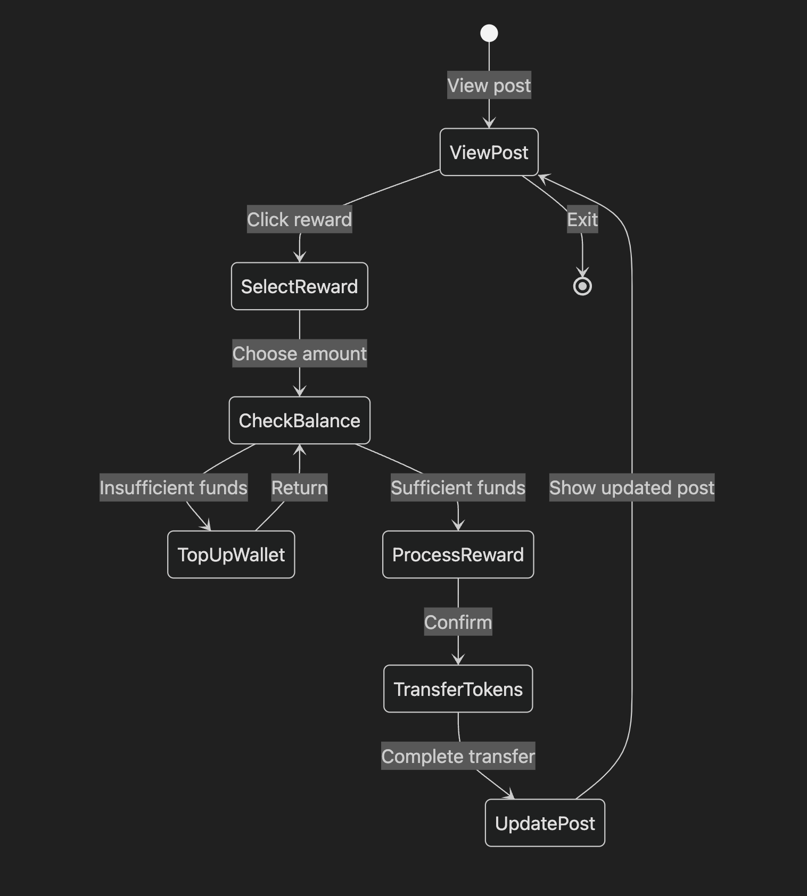

# Specification Phase Exercise

A little exercise to get started with the specification phase of the software development lifecycle. See the [instructions](instructions.md) for more detail.

## Team members

- Cyan Yan: <https://github.com/chenxin-yan>
- Jackson Chen: <https://github.com/jaxxjj>

## Stakeholders

See instructions. Delete this line and replace with the name(s) of the stakeholder(s) you interviewed and lists showing their goals/needs, and problems/frustrations.

## Product Vision Statement

See instructions. Delete this line and place your Product Vision Statement here.

## User Requirements

1. **Interacting with Posts**  
   _As a user, I want to like, comment on, and share other users’ posts so that I can engage with the content and show my support or feedback._

2. **Reward Tokens to Posts**  
   _As a user, I want the ability to sponsor other users' posts with tokens for their posts so that I can show my appreciation and support._

3. **User Profiles**  
   _As a user, I want to have a personal profile (including a photo, a short bio, and my posts) so that others can quickly learn more about me and my interests._

4. **Search Posts and Hashtags**  
   _As a user, I want to search for posts by keywords or hashtags so that I can easily find and follow relevant discussions on topics that interest me._

5. **Searching Other Users**  
   _As a user, I want to search for other user profiles so that I can connect with people who share similar interests or expertise._

6. **Unlock Premium Content**  
   _As a user, I want to use my accumulated reward tokens to unlock premium content so that I can gain access to advanced articles, videos, or features._

7. **Token Top-Up**  
   _As a user, I want the option to purchase or top up my tokens with real currency so that I can reward posts and unlock premium content immediately._

8. **Posting Content**  
   _As a content creator, I want to create a new post (with text, images, or both) so that I can share my ideas and experiences with the community._

9. **Hashtag Usage**  
   _As a content creator, I want to add relevant hashtags to my posts so that they are more discoverable by others who are interested in those topics._

10. **Reward for Likes**  
    _As a content creator, I want to earn tokens each time someone likes or sponsors my post so that I feel recognized for my contributions._

11. **Gamification Progress**  
    _As a user, I want to see my token balance and any achievements or milestones so that I can track my progress and stay motivated to contribute my ideas._

## Activity Diagrams

1. **Interacting with Posts**  
   _As a user, I want to like, comment on, and share other users’ posts so that I can engage with the content and show my support or feedback._

2. **Reward Tokens to Posts**  
   _As a user, I want the ability to sponsor other users' posts with tokens for their posts so that I can show my appreciation and support._

## Clickable Prototype

See instructions. Delete this line and place a publicly-accessible link to your clickable prototype here.
